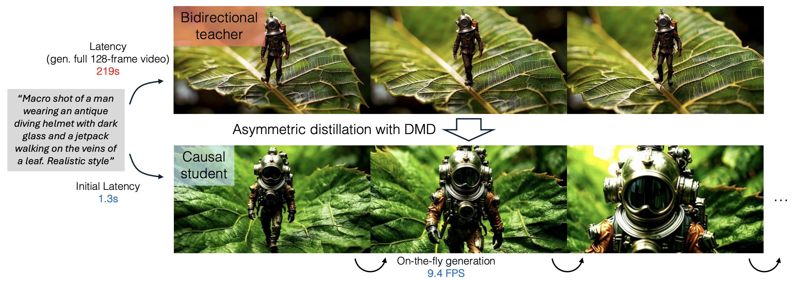

# From Slow Bidirectional to Fast Autoregressive Video Diffusion Models [[Huggingface](https://huggingface.co/tianweiy/CausVid)][[Project](https://causvid.github.io/)]

Few-step Text-to-Video Generation.



> [**From Slow Bidirectional to Fast Autoregressive Video Diffusion Models**](https://causvid.github.io/),            
> Tianwei Yin*, Qiang Zhang*, Richard Zhang, William T. Freeman, Frédo Durand, Eli Shechtman, Xun Huang (* equal contribution)       
> *CVPR 2025 ([arXiv 2412.07772](https://arxiv.org/abs/2412.07772))*  

## Abstract

Current video diffusion models achieve impressive generation quality but struggle in interactive applications due to bidirectional attention dependencies. The generation of a single frame requires the model to process the entire sequence, including the future. We address this limitation by adapting a pretrained bidirectional diffusion transformer to an autoregressive transformer that generates frames on-the-fly. To further reduce latency, we extend distribution matching distillation (DMD) to videos, distilling 50-step diffusion model into a 4-step generator. To enable stable and high-quality distillation, we introduce a student initialization scheme based on teacher's ODE trajectories, as well as an asymmetric distillation strategy that supervises a causal student model with a bidirectional teacher. This approach effectively mitigates error accumulation in autoregressive generation, allowing long-duration video synthesis despite training on short clips. Our model achieves a total score of 84.27 on the VBench-Long benchmark, surpassing all previous video generation models. It enables fast streaming generation of high-quality videos at 9.4 FPS on a single GPU thanks to KV caching. Our approach also enables streaming video-to-video translation, image-to-video, and dynamic prompting in a zero-shot manner. 

<div style="border-top: 2px solid red; padding-top: 10px; margin-top: 10px; margin-bottom: 10px;">
  ⚠️ This repo is a work in progress. Expect frequent updates in the coming weeks.
</div>


## Environment Setup 

```bash
conda create -n causvid python=3.10 -y
conda activate causvid
pip install torch torchvision 
pip install -r requirements.txt 
python setup.py develop
```

Also download the Wan base models from [here](https://github.com/Wan-Video/Wan2.1) and save it to wan_models/Wan2.1-T2V-1.3B/

## Inference Example 

First download the checkpoints: [Autoregressive Model](https://huggingface.co/tianweiy/CausVid/tree/main/autoregressive_checkpoint), [Bidirectional Model 1](https://huggingface.co/tianweiy/CausVid/tree/main/bidirectional_checkpoint1) or [Bidirectional Model 2](https://huggingface.co/tianweiy/CausVid/tree/main/bidirectional_checkpoint2) (performs slightly better). 

### Autoregressive 3-step 5-second Video Generation  

```bash 
python minimal_inference/autoregressive_inference.py --config_path configs/wan_causal_dmd.yaml --checkpoint_folder XXX  --output_folder XXX   --prompt_file_path XXX 
```

### Autoregressive 3-step long Video Generation

```bash 
python minimal_inference/longvideo_autoregressive_inference.py --config_path configs/wan_causal_dmd.yaml --checkpoint_folder XXX  --output_folder XXX   --prompt_file_path XXX   --num_rollout XXX 
```

### Bidirectional 3-step 5-second Video Generation

```bash 
python minimal_inference/bidirectional_inference.py --config_path configs/wan_bidirectional_dmd_from_scratch.yaml --checkpoint_folder XXX  --output_folder XXX   --prompt_file_path XXX 
```

## Training and Evaluation  

### Dataset Preparation 

We use the [MixKit Dataset](https://huggingface.co/datasets/LanguageBind/Open-Sora-Plan-v1.1.0/tree/main/all_mixkit) (6K videos) as a toy example for distillation. 

To prepare the dataset, follow these steps. You can also download the final LMDB dataset from [here](https://huggingface.co/tianweiy/CausVid/tree/main/mixkit_latents_lmdb)

```bash
# download and extract video from the Mixkit dataset 
python distillation_data/download_mixkit.py  --local_dir XXX 

# convert the video to 480x832x81 
python distillation_data/process_mixkit.py --input_dir XXX  --output_dir XXX --width 832   --height 480  --fps 16 

# precompute the vae latent 
torchrun --nproc_per_node 8 distillation_data/compute_vae_latent.py --input_video_folder XXX  --output_latent_folder XXX   --info_path sample_dataset/video_mixkit_6484_caption.json

# combined everything into a lmdb dataset 
python causvid/ode_data/create_lmdb_iterative.py   --data_path XXX  --lmdb_path XXX
```

## Training 

Please first modify the wandb account information in the respective config.  

Bidirectional DMD Training

```bash
torchrun --nnodes 8 --nproc_per_node=8 --rdzv_id=5235 \
    --rdzv_backend=c10d \
    --rdzv_endpoint $MASTER_ADDR causvid/train_distillation.py \
    --config_path  configs/wan_bidirectional_dmd_from_scratch.yaml 
```

ODE Dataset Generation. We generate a total of 1.5K dataset pairs, which can also be downloaded from [here](https://huggingface.co/tianweiy/CausVid/tree/main/mixkit_ode_lmdb) 

```bash
torchrun --nproc_per_node 8 causvid/models/wan/generate_ode_pairs.py --output_folder  XXX --caption_path sample_dataset/mixkit_prompts.txt

python causvid/ode_data/create_lmdb_iterative.py  --data_path XXX --lmdb_path XXX 
```

Causal ODE Pretraining. You can also skip this step and download the ode finetuned checkpoint from [here](https://huggingface.co/tianweiy/CausVid/tree/main/wan_causal_ode_checkpoint_model_003000) 

```bash
torchrun --nnodes 8 --nproc_per_node=8 --rdzv_id=5235 \
    --rdzv_backend=c10d \
    --rdzv_endpoint $MASTER_ADDR causvid/train_ode.py \
    --config_path  configs/wan_causal_ode.yaml  --no_visualize
```

Causal DMD Training.   

```bash
torchrun --nnodes 8 --nproc_per_node=8 --rdzv_id=5235 \
    --rdzv_backend=c10d \
    --rdzv_endpoint $MASTER_ADDR causvid/train_distillation.py \
    --config_path  configs/wan_causal_dmd.yaml  --no_visualize
```

## TODO 
- [ ] Checkpoints trained on larger / higher quality dataset.    
- [ ] Image to Video Generation
- [ ] Caching of cross-attention features

## Notes

- With the toy dataset, the performance saturates around 1K iterations.
- DMD training likely requires larger, higher-quality datasets.
- Timestep shift, guidance scale, or denoising steps may need fine-tuning.

## Citation 

If you find CausVid useful or relevant to your research, please kindly cite our papers:

```bib
@inproceedings{yin2025causvid,
    title={From Slow Bidirectional to Fast Autoregressive Video Diffusion Models},
    author={Yin, Tianwei and Zhang, Qiang and Zhang, Richard and Freeman, William T and Durand, Fredo and Shechtman, Eli and Huang, Xun},
    booktitle={CVPR},
    year={2025}
}

@inproceedings{yin2024improved,
    title={Improved Distribution Matching Distillation for Fast Image Synthesis},
    author={Yin, Tianwei and Gharbi, Micha{\"e}l and Park, Taesung and Zhang, Richard and Shechtman, Eli and Durand, Fredo and Freeman, William T},
    booktitle={NeurIPS},
    year={2024}
}

@inproceedings{yin2024onestep,
    title={One-step Diffusion with Distribution Matching Distillation},
    author={Yin, Tianwei and Gharbi, Micha{\"e}l and Zhang, Richard and Shechtman, Eli and Durand, Fr{\'e}do and Freeman, William T and Park, Taesung},
    booktitle={CVPR},
    year={2024}
}
```

## Acknowledgments

Our implementation is largely based on the [Wan](https://github.com/Wan-Video/Wan2.1) model suite.

